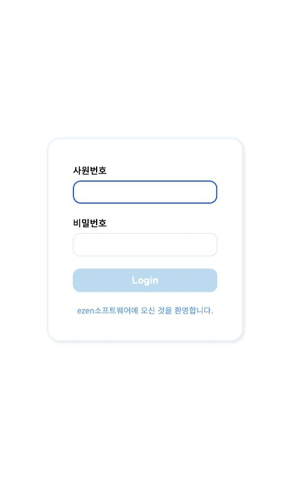
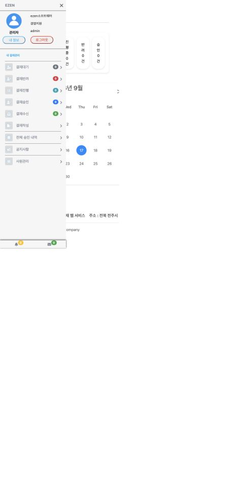
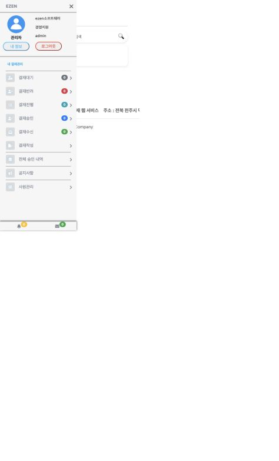
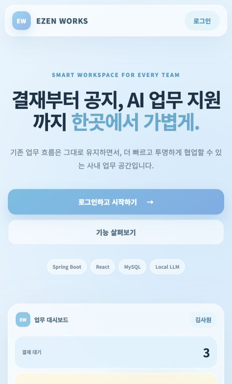
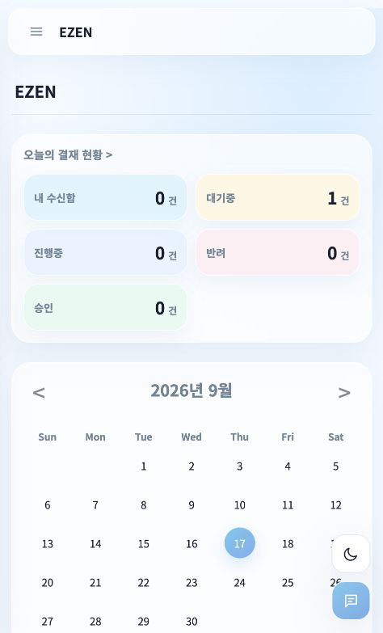
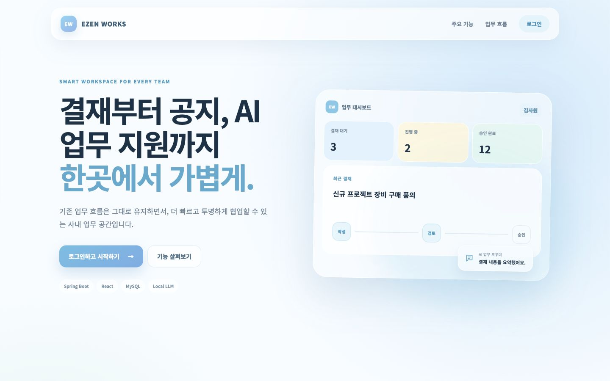
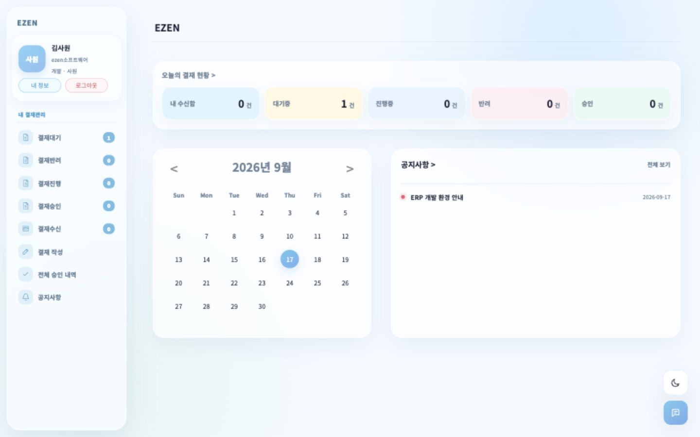

# 프론트엔드 React/Vite 전환 기록

## 목표

기존 JSP 화면의 URL과 Spring Security 권한 검사는 유지하면서 로그인, 공통 레이아웃, 메인, 결재 목록·상세를 React로 점진 전환했습니다. Bootstrap 4와 5의 중복 CDN을 제거하고 모든 화면에 반응형 CSS 기반을 적용했습니다.

## 구현 구조

```text
브라우저
  ├─ React 19 / Vite 8
  │    ├─ 공개 랜딩·로그인
  │    ├─ 공통 사이드바·상단바
  │    ├─ 대시보드
  │    └─ 결재 목록·상세
  └─ /api/* JSON
       └─ FrontendApiController
            ├─ ApprovalService
            └─ NoticeService
```

기존 `.do` 주소는 유지합니다. 따라서 북마크와 서버 권한 테스트를 깨뜨리지 않고 React 화면을 적용할 수 있습니다. 아직 전환하지 않은 결재 작성·수정, 수신함, 공지사항, 사원관리 JSP는 `responsive.css`를 사용하며 Bootstrap 없이 동작합니다.

## JSON API

| API | 용도 | 공개 범위 |
|---|---|---|
| `GET /api/session` | 로그인 사용자와 CSRF 토큰 | 비로그인 접근 허용 |
| `GET /api/dashboard` | 결재 상태 건수와 최근 공지 | 로그인 사용자 |
| `GET /api/approvals` | 검색·상태·페이지 기반 내 결재 목록 | 로그인 사용자 |
| `GET /api/approvals/{id}` | 문서·결재선·첨부파일·가능 작업 | 기존 문서 열람 권한 적용 |

사용자 JSON에는 비밀번호, 주민번호 등 민감 필드를 포함하지 않습니다. 이 조건은 17번째 통합 테스트로 고정했습니다.

## Bootstrap 제거와 반응형 처리

- Bootstrap 4·5 CSS/JS CDN 제거
- React 화면은 자체 CSS Grid/Flexbox와 1080px·760px·430px 반응형 구간 사용
- 기존 JSP는 Bootstrap에서 사용하던 최소 유틸리티만 `responsive.css`로 대체
- Bootstrap 모달은 자체 오버레이와 JavaScript 열기·닫기로 교체
- 모바일 사이드 드로어, 1440px 데스크톱 레이아웃, 키보드 포커스와 `prefers-reduced-motion` 적용
- 우측 하단 다크모드와 AI 챗봇 버튼을 React 및 기존 JSP 공통 제공

챗봇은 현재 UI와 로컬 LLM API 연결 지점만 제공합니다. 실제 답변을 가장하지 않고 연동 전 상태를 명확히 표시합니다.

## 화면 비교

### Before

| 로그인 | 메인 | 결재 목록 |
|---|---|---|
|  |  |  |

### After

| 모바일 랜딩 | 모바일 메인 |
|---|---|
|  |  |

| 데스크톱 랜딩 | 데스크톱 메인 |
|---|---|
|  |  |

## 성능 측정

동일 장비·데이터·계정에서 워밍업 5회 후 순차 50회 요청했습니다.

| 화면 | 평균 Before → After | 평균 변화 | p95 Before → After | p95 변화 |
|---|---:|---:|---:|---:|
| 메인 | 2.78ms → 1.09ms | -60.8% | 3.78ms → 1.48ms | -60.8% |
| 결재 목록 | 3.00ms → 0.88ms | -70.7% | 3.92ms → 1.08ms | -72.4% |

서버가 목록 데이터를 포함한 JSP를 렌더링하는 대신 가벼운 React 셸을 반환하게 된 변화입니다. JSON API 요청과 브라우저 렌더링 시간을 합친 사용자 체감 성능은 별도 RUM 또는 Lighthouse 측정이 필요합니다.

프로덕션 빌드 크기는 JavaScript 249.59KB(gzip 76.96KB), CSS 39.76KB(gzip 8.87KB)입니다.

## 트러블슈팅

### React 전환 뒤 기존 CSRF 통합 테스트 4건 실패

원인: 기존 테스트와 폼 전송 헬퍼가 페이지의 숨은 `_csrf` 입력값을 읽는데, 최초 React 셸은 메타 태그만 제공했습니다.

해결: React용 메타 태그와 기존 폼용 숨은 입력값을 함께 제공했습니다. 점진적 전환 중인 JSP와 React가 같은 보안 설정을 공유하면서 기존 회귀 테스트도 유지됩니다.

### 상세에서 목록으로 이동할 때 빈 화면

원인: 상세 컴포넌트의 `useEffect`가 데이터 요청 Promise를 반환했습니다. 화면 전환으로 컴포넌트가 해제될 때 React가 이 값을 정리 함수로 호출해 `TypeError`가 발생했습니다.

해결: 효과 함수가 값을 반환하지 않고 내부에서 로딩 함수만 실행하도록 변경했습니다. 수정 후 상세→목록→상세 동적 이동을 반복하고 새 콘솔 오류가 없음을 확인했습니다.

## 검증 결과

- `npm ci && npm run build`: 성공
- `./mvnw --batch-mode test`: 17개 성공, 실패 0, 오류 0
- 브라우저: 모바일 기본 뷰포트와 1440×900 데스크톱 검증
- 라이트·다크 테마, 챗봇 패널, 모바일 메뉴, 목록·상세 동적 전환 확인
